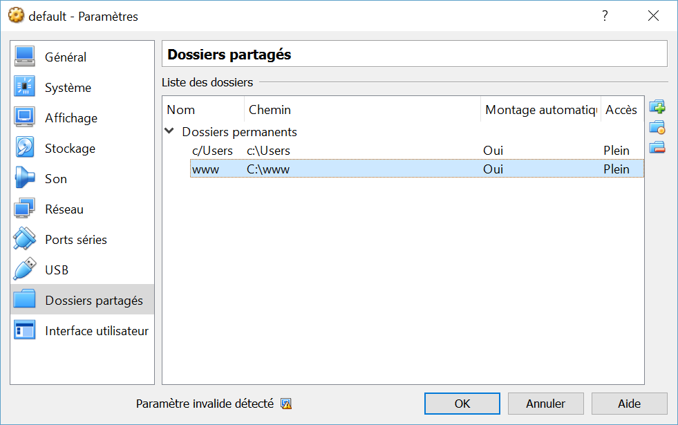

# ZSH-PHP
PHP-Development container with :

- ZSH - http://www.zsh.org/
- Oh-My-Zsh - http://ohmyz.sh/
- Composer - https://getcomposer.org/
- Symfony installer - https://symfony.com/

Ports exposed:
- **8000** : for Symfony built-in server (PHP)

## Installation
ZSH-PHP require docker.

First, run your docker terminal.

Then you will need to clone this repo :

```sh
$ git clone git@github.com:stayfi/zsh-php.git
$ cd zsh-php
```

You have to add shared folders to your docker virtual machine, in Oracle VM Virtual Box :

- shared vm name "**www**" -> To your "www" root



You have to add the "`bootlocal.sh`" file to your virtual machine in this folder "`/var/lib/boot2docker/`" :

```sh
$ docker-machine ssh default
* "(assuming 'default' is your docker virtual machine name)"
$ sudo vi /var/lib/boot2docker/bootlocal.sh
* "paste those lines into this new file:"
mkdir -p /home/docker/zsh-php/www
mount -t vboxsf www /home/docker/zsh-php/www

$ sudo chmod +x /var/lib/boot2docker/bootlocal.sh
```

Restart your docker machine (assuming "default" is your docker virtual machine name):
```sh
$ docker-machine restart default
```

Build zsh-php container :
```sh
$ docker build -t stayfi/zsh-php zsh-php
```

## Usage

Run zsh-php by :
```sh
$ docker run -ti -p 8000:8000 -v /home/docker/zsh-php/www:/var/www stayfi/zsh-php /bin/zsh
```

You will have your zsh prompt.

#### Composer

```sh
$ composer --version
```

#### Symfony Installer

```sh
$ symfony --version
$ symfony new my-project
```

#### Symfony built-in server

```sh
$ cd my-project
$ php bin/console server:run 0.0.0.0:8000
```
Important : user **0.0.0.0:8000** address.

Assuming your default docker IP address is 192.168.99.11, you can acces to :

##### Web server : http://192.168.99.100:8000
To start working on your project.

## Credits
Stayfi B. - <stayfi@gmail.com>

## Versions
(Major.Minor[.Fix])

#### 1.0
First version, working.

## License
MIT license
